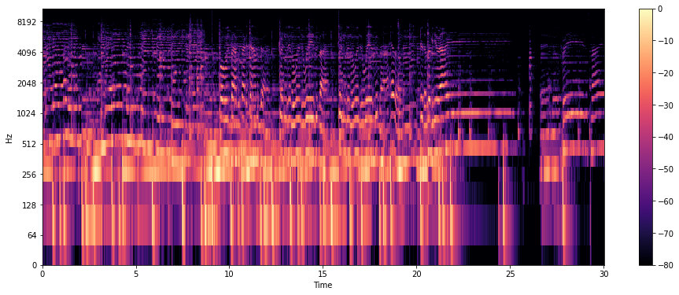
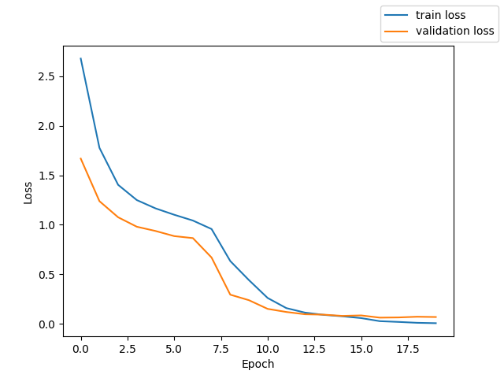
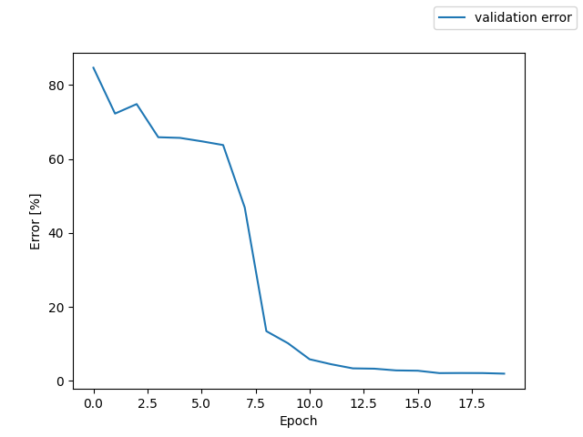

# asr-demo
音声認識のデモのコード管理



### 目的
- 音声認識の勉強のため
- Cloud Run の活用
- postry を使いたかった

## デモ
 
[デモの URL はこちら](https://asr-demo-pzf4pyx4mq-an.a.run.app)

### 手順

1. サンプルの音声(sample/test.wav)を確認

2. 「ファイル選択」でそのファイルを選択する

3. 「送信」ボタンで結果を確認

4. 「水をマレーシアから買わなくてはならないのです」と言っているのと比較

*もし、自身の音声で試したい場合はページで録音も可能にしています。
保存などは外部にしていないので大丈夫だと思います。*

## 環境構築メモ
python version => 3.7

学習したモデルを `exp_train_large/` に配置

**学習したモデルの公開はライセンス次第**

ローカル起動の場合
```shell
export PORT=2626
export FLASK_APP="server.py"
flask run --host=0.0.0.0 --port=$PORT --with-threads > stdout.log 2> stderr.log
```
[ここ](http://localhost:2626)にアクセスして確認

## リリースメモ
```shell
# イメージをローカルで確認
docker build -t asr .
docker run -d --rm --env PORT=2626 -p 2626:2626 -it asr

# poetry -> requirements.txt
poetry export --without-hashes -f requirements.txt > requirements.txt

# release
export PRJ=< your project >
export IMG=asr-demo
gcloud builds submit --tag asia.gcr.io/$PRJ/$IMG --timeout 1h

gcloud run deploy asr-demo \
            --image asia.gcr.io/$PRJ/$IMG \
            --region asia-northeast1 \
            --max-instances=1 \
            --min-instances=0 \
            --platform managed \
            --set-env-vars "FLASK_URL= <your URL>"
```


## モデル
- ESRNet をベースにしている(End-to-End)
    - CTC loss
    - attention

- データは JUST で事前学習を行った
    - ４時間ほどの軽い学習

- Lossの推移



- 文字列認識率推移




## TODO

- [wav2vec](https://arxiv.org/abs/2006.11477) なども使いたい 
- ノイズに強くする
- 録音周期(Hz)にも適応したい


### 参考知識
- JUST dataset: https://www.jstage.jst.go.jp/article/ast/41/5/41_E1950/_article/-char/ja/
- 人間の鼓膜の音源分離 : https://asa.scitation.org/doi/10.1121/1.1915893
- 機械音文献 : https://www.cambridge.org/core/journals/journal-of-the-international-phonetic-associa[…]p-xviii-568-isbn-0201165201/9D7DFF2C6517511ACFC014191A68A959
- cepstrum : The quefrency analysis of time series for echoes : cepstrum, pseudo-autocovariance, cross-cepstrum and saphe cracking(ネットになし)
- fbank : https://www.semanticscholar.org/paper/Decorrelated-and-liftered-filter-bank-energies-for-Paliwal/06b2131e730e2ef455b245fbe9dcbd58b0e6973a
- DP : https://ieeexplore.ieee.org/document/1163055
- DP matching: https://ieeexplore.ieee.org/document/1163310
- EM algorithm: https://rss.onlinelibrary.wiley.com/doi/10.1111/j.2517-6161.1977.tb01600.x
- hidden markov : https://www.amazon.co.jp/Application-Hidden-Recognition-Foundations-Processing/dp/1601981201
- maximazation chain markov: https://projecteuclid.org/journals/annals-of-mathematical-statistics/volume-41/issue-[…]- tical-Analysis-of-Probabilistic/10.1214/aoms/1177697196.full
- viterbi argorithm: https://ieeexplore.ieee.org/document/1054010
- likelyhood -> nn : https://ieeexplore.ieee.org/document/6296526 , https://www.isca-speech.org/archive/interspeech_2011/i11_0437.html
- n-gram : http://citeseerx.ist.psu.edu/viewdoc/summary?doi=10.1.1.108.1115
- WFST(decoder) : https://cs.nyu.edu/~mohri/pub/hbka.pdf
- GRU (おさらい): https://arxiv.org/abs/1409.1259, https://arxiv.org/abs/1412.3555
- encoder-decoder(おさらい) : https://arxiv.org/abs/1409.3215
- CTC : (paper) https://www.cs.toronto.edu/~graves/icml_2006.pdf (book)https://www.cs.toronto.edu/~graves/preprint.pdf
- attention: https://arxiv.org/abs/1508.04395, https://arxiv.org/abs/1508.01211 (元)https://arxiv.org/abs/1409.0473
- CTC-attention: https://ieeexplore.ieee.org/document/8068205
- ESPNet: (paper)https://arxiv.org/abs/1804.00015 (toolkit)https://github.com/espnet/espnet
- Transformer(一応?): (いつもの)https://arxiv.org/abs/1706.03762, (speech)https://ieeexplore.ieee.org/document/8462506
- BPTT ないから学習早い: https://www.isca-speech.org/archive/Interspeech_2019/abstracts/1938.html
- conformer: https://www.isca-speech.org/archive/Interspeech_2020/abstracts/3015.html
- wav2vec: https://proceedings.neurips.cc/paper/2020/file/92d1e1eb1cd6f9fba3227870bb6d7f07-Paper.pdf

### 文献
- Pythonで学ぶ音声認識 機械学習実践シリーズ (著書: 高島 遼一)


